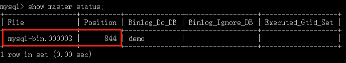
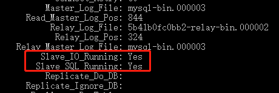

# 配置说明
## 主库
```
server-id=1 # 服务器 id, 必须每台唯一
log-bin=mysql-bin # 设置 bin-log 文件名
binlog-do-db=demo # 设置要同步的数据库
```
## 从库
```
server-id=2 # 服务器 id, 不能与主库相同
replicate_wild_do_table=demo.% # 设置要同步的数据库
relay-log=mysql-relay-bin # 设置 relay-log 文件名
```
# 启动服务
```
docker-compose up -d
```
# 配置主库
## 使用 root 登录主库
```
docker-compose exec demo-mysql-master mysql -uroot -p demo
```
## 创建用户用于同步
```
CREATE USER 'db_sync'@'%' IDENTIFIED WITH mysql_native_password BY 'password';
GRANT REPLICATION SLAVE ON *.* TO 'db_sync'@'%';
FLUSH PRIVILEGES;
```
## 记录日志文件和位点
```
show master status;
```
记录输出信息中的日志文件和位点信息，如下图。


# 配置从库
## 使用 root 登录从库
```
docker-compose exec demo-mysql-slave mysql -uroot -p demo
```
## 设置同步
```
stop slave;
CHANGE MASTER TO master_host='demo-mysql-master',master_user='db_sync',master_password='password',master_log_file='mysql-bin.000003',master_log_pos=844;
start slave;
show slave status\G
```
命令中的日志文件和位点信息需要按照配置主库时记录的值进行填写。配置成功后输出如下信息。


# 备注
- 本例中使用显式设置位点的方式开始同步，需要在开始同步前**保证主从库状态相同**。
- 从库配置中如不设置 `relay-log=mysql-relay-bin` ，`CHANGE MASTER` 时日志中出现如下警告。
  > Neither --relay-log nor --relay-log-index were used; so replication may break when this MySQL server acts as a slave and has his hostname changed!!

  当前服务器作为从库，如未设置 relay-log，MySQL 将根据主机名自动生成 ralay-log 设置，此时如果主机名发生变化，会导致同步被断开。显式设置 relay-log 后，警告消除。
